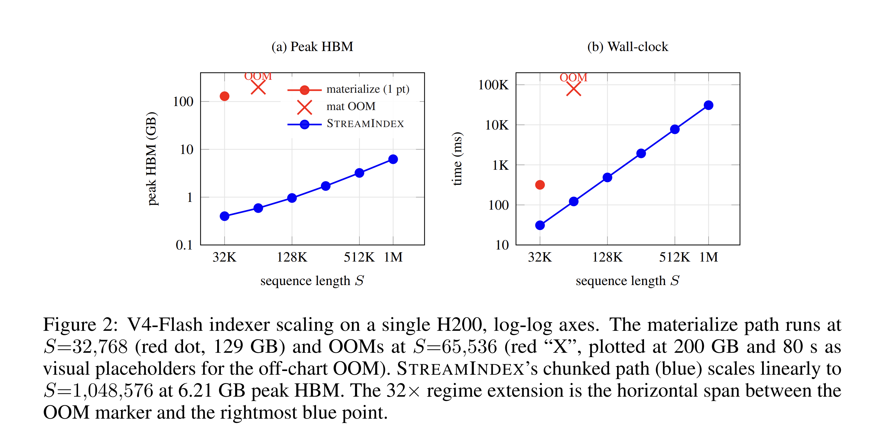
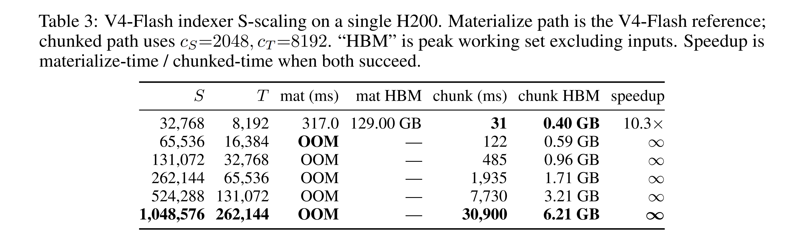

# StreamIndex

> Memory-bounded compressed sparse attention via streaming top-k.
> Triton implementation of the DeepSeek-V4 lightning indexer that runs at
> sequence lengths where the reference materialize-then-topk path OOMs.

[](https://arxiv.org/abs/2605.02568)
[](LICENSE)
[](https://www.python.org/)
[](https://github.com/triton-lang/triton)

<p align="center">
  
</p>

<p align="center">
  <em>V4-Flash indexer scaling on a single NVIDIA H200, log-log axes. Materialize (red) OOMs at S=65,536. StreamIndex (blue) scales linearly to S=1,048,576 at 6.21 GB peak HBM, a 32× regime extension. The same pattern holds at V4-Pro dimensions:</em>
</p>

<p align="center">
  
</p>

## What this is

DeepSeek-V3.2 and V4 introduce **Compressed Sparse Attention (CSA)**: a
lightning indexer scores compressed keys, the top-`k` are selected per
query, and a sparse attention kernel reads only those keys. Public CSA
implementations (V3.2-Exp reference, TileLang reference) materialize a
`[B, S, H_I, T]` FP32 score tensor before the top-`k` reduction. With
V4-Flash dimensions (`H_I = 64`, `m = 4`), that intermediate is **256 GB
at S = 65,536**, exceeding the HBM of any single current GPU.

**StreamIndex** is a Triton implementation of the CSA pipeline. The core
component is a chunked partition-merge top-`k` driver that never
materializes the full intermediate. On a single NVIDIA H200, the
materialize path OOMs at `S = 65,536` with V4-Flash dimensions; StreamIndex
runs the same indexer to `S = 1,048,576` with **6.21 GB peak HBM**, a
**32× regime extension** on a single GPU.

## Result snapshot

V4-Flash indexer scaling, single H200 SXM, BF16:

| Sequence length `S` | Materialize | StreamIndex (chunked) | Speedup |
|---:|---|---|---|
| 32,768 | 317 ms / 129 GB | **31 ms / 0.40 GB** | 10.3× |
| 65,536 | **OOM** | 122 ms / 0.59 GB | ∞ |
| 131,072 | OOM | 485 ms / 0.96 GB | ∞ |
| 262,144 | OOM | 1,935 ms / 1.71 GB | ∞ |
| 524,288 | OOM | 7,730 ms / 3.21 GB | ∞ |
| **1,048,576** | **OOM** | **30,900 ms / 6.21 GB** | **∞** |

Set-overlap recall against the materialize ground truth is bit-exact at
small `S` where both fit. Raw logs are in
[`benchmarks/results/`](benchmarks/results/).

## Install

Editable install (recommended for development):

```bash
git clone https://github.com/RightNow-AI/StreamIndex
cd StreamIndex
pip install -e .
```

Requirements: PyTorch ≥ 2.10, Triton ≥ 3.5, CUDA 12.x or 13.x, Python ≥ 3.11.
Tested on H100 / H200 (Hopper, `sm_90a`).

## Quick start

```python
import torch
from flash_sparse.triton.chunked_indexer import chunked_indexer_topk

B, S, H_I, D_I = 1, 262144, 64, 128
T = S // 4   # m = 4 compression
k = 512

q       = torch.randn(B, S, H_I, D_I, dtype=torch.bfloat16, device="cuda") * (D_I**-0.5)
k_idx   = torch.randn(B, T, D_I,      dtype=torch.bfloat16, device="cuda") * (D_I**-0.5)
weights = torch.randn(B, S, H_I,      dtype=torch.float32,  device="cuda")

# Returns top-k indices [B, S, k] int64 + scores [B, S, k] FP32.
top_idx, _ = chunked_indexer_topk(
    q, k_idx, weights, top_k=k,
    causal_ratio=4,         # V4 causal mask: t < (s+1) // ratio
    chunk_s=2048, chunk_t=8192,
)
```

The `causal_ratio` argument is what enables long-context scaling: it
computes the per-tile causal mask without materializing the global
`[B, S, T]` bool tensor, which is itself 256 GB at `S = 1M, T = 256K`.

## Repository layout

```
flash_sparse/
  csa.py                     End-to-end CSA forward (compressor + indexer + sparse-attn).
  hca.py                     Heavily-compressed-attention helpers.
  reference.py               PyTorch reference implementations (correctness ground truth).
  triton/
    chunked_indexer.py       The chunked partition-merge top-k driver (151 LOC).
    indexer_score.py         Fused Triton indexer score kernel (Q.K^T, ReLU, weighted sum).
    sparse_attn_fwd.py       Triton sparse attention forward (single-D MQA layout).
    sparse_attn_bwd.py       Triton sparse attention backward (atomic-scatter dKV).
    sparse_attn_bwd_v2.py    Backward variant using inverted-topk (research artifact).
    indexer_streaming_topk.py In-kernel streaming top-k attempt (parked, see file).
    inverted_topk.py         Inverted-index builder used by the v2 backward.
  utils/                     Compression / quantization stubs.

tests/                       Correctness tests (pytest). All require CUDA.
benchmarks/                  Benchmark scripts and raw result snapshots.
  results/2026-04-25/        Kernel-level bench snapshot.
  results/2026-04-27/        V4-Flash layer-level snapshot (32x regime extension).
  results/2026-05-01/        Design-space sweep and ablations.
eval/                        Reproducibility scripts: parity test, scaling bench, sweep.
docs/                        Math doc, IR analysis, fusion analysis, integration plan.
```

## Reproducing the results

```bash
# Parity check (small S, materialize fits as ground truth):
python eval/test_v4_indexer_parity.py

# Layer-level S-scaling (the 32x regime extension):
python eval/bench_v4_indexer_scaling.py

# Design-space sweep (chunk_S, chunk_T, top_k):
python eval/sweep_design_space.py

# Three ablations (no-merge, skip-saturated, FP16 accumulation):
python eval/ablation_chunked_indexer.py
```

Each script is a single Python file with no required arguments. Logs are
written to stdout. Reference numbers live under `benchmarks/results/`.

## Limitations

This is a kernel and a Python driver, not an end-to-end system.

1. Tested on synthetic-but-realistic distributions, not loaded V4
   checkpoint weights. The 270 GB FP8 V4-Flash weights do not fit on a
   single H200; multi-GPU follow-up is required for end-to-end
   perplexity, retrieval, QA, or code benchmarks.
2. Total HBM I/O is unchanged from the materialize path. Only peak is
   reduced. At small `S` where materialize fits, materialize is faster.
   The chunked path is the only viable option at long context.
3. The auxiliary Triton attention forward in `flash_sparse/triton/`
   reaches about 8% of H200 BF16 peak at V4-Pro dimensions
   (`d_h = 512`). For production attention throughput, compose the
   chunked indexer with TileLang's pipelined `sparse_mla_fwd` (we
   benchmark this in `benchmarks/bench_pipeline_composition.py`).

## Citation

```bibtex
@article{jaber2026streamindex,
  title         = {{StreamIndex}: Memory-Bounded Compressed Sparse Attention via Streaming Top-k},
  author        = {Jaber, Jaber and Jaber, Osama},
  year          = {2026},
  eprint        = {2605.02568},
  archivePrefix = {arXiv},
  primaryClass  = {cs.LG},
  url           = {https://arxiv.org/abs/2605.02568},
}
```

## License

MIT. See [`LICENSE`](LICENSE).

## Acknowledgements

StreamIndex builds on the V3.2-Exp / V4 reference modelling code released
by DeepSeek-AI, the TileLang `sparse_mla_fwd_pipelined` attention kernel,
the Triton compiler, and the FlashAttention line of work.

---

<p align="center"><sub>by <a href="https://www.rightnowai.co/">RightNow Lab</a></sub></p>
